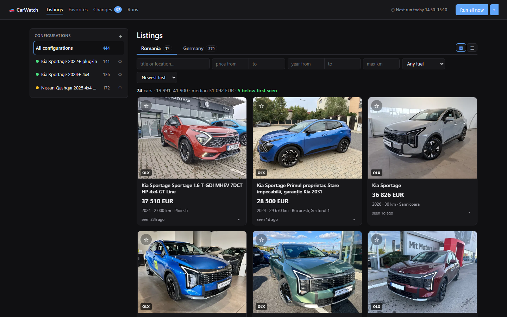
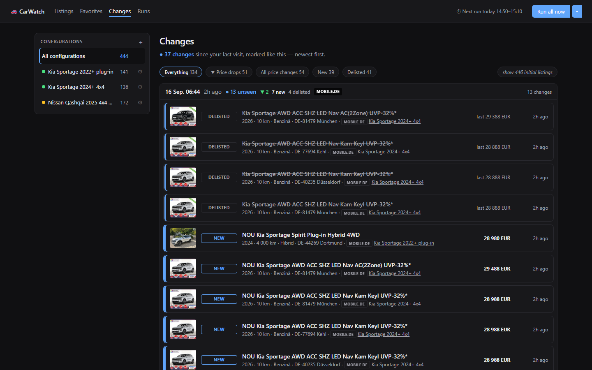

# CarWatch

**Track the same car hunt across three listing sites, and see what actually changed.**

CarWatch collects the cars matching searches you define on **autovit.ro**, **olx.ro** and
**mobile.de/ro**, keeps their prices and availability in a local SQLite database, and reads it
back in a dashboard that runs on your own machine. No account, no cloud, no data leaving the
computer. Windows and macOS.

**Why not the sites' own saved-search alerts?** Those tell you about *new* listings, one site
at a time. This adds the two things they never do: **one view over all three sites**, and
**history** — that an ad has come down €1,500 over three weeks, or quietly vanished.



*Listings, scoped to one market. The sidebar counts cars per configuration and colours each
one by health; the badge on Changes counts what has arrived since you last looked.*

```bash
git clone https://github.com/AlexaAndreas99/carwatch.git
cd carwatch
./setup.sh          # macOS  ·  Windows: .\setup.ps1
```

Then paste your search URLs into `config.yaml` and open the dashboard. Full setup is below.

## What it does

- **Merges the same car across sites.** One ad carried by autovit and olx is one card, badged
  with both sources, not two rows you have to notice are the same.
- **Keeps a price history** per car, with a chart, so a "€1,000 off!" ad that has been
  bouncing between two prices for a month is visible as exactly that.
- **Notices what disappears.** A car that stops showing up is marked delisted rather than
  silently dropped, because an ad vanishing is information too.
- **Tells you what changed since you last looked** — a feed grouped by collection, and a
  count on the tab of changes you have not seen.
- **Separates the markets.** Romanian and German cars are counted and priced apart; prices in
  another currency are left out of a median rather than silently converted at a made-up rate.
- **Says when a source is failing.** A search returning nothing because a site quietly widened
  it looks different from one genuinely finding nothing — that distinction is the health dot.
- **Collects when you ask**, from the dashboard or the command line, with an optional schedule
  (off by default) registered with the system's own scheduler — Task Scheduler or launchd.
- **Stars cars you care about** on a Favorites page, keyed to the ad, so a favourite survives
  the listing row that showed it.



*The changes feed, grouped by collection. What arrived since your last visit is marked down
the left; everything else folds away.*

Nothing about the cars is baked in: CarWatch tracks whatever search URLs you paste, across any
subset of the three sites, so a new hunt is a config change and never a code change.

**Built with** Python 3.11+, FastAPI, SQLModel over SQLite, Jinja2 and htmx, with Playwright
for the sites that refuse plain HTTP requests. No JavaScript build step, no database server.
MIT licensed.

## Install

Requires **Python 3.11+**. One script does the rest: it creates the virtual environment,
installs the dependencies, installs the Chromium that olx.ro needs, and copies
`config.example.yaml` to `config.yaml` for you to fill in. Running it again is harmless —
anything already in place is left alone.

### Windows (PowerShell)

```powershell
.\setup.ps1
```

Then `.\install-shortcut.ps1` puts a CarWatch icon on the Desktop and in the Start menu;
double-clicking it starts the dashboard and opens the browser.

### macOS

```bash
./setup.sh
```

Then double-click `CarWatch.command` in Finder. The first time, right-click it and choose
**Open**, because macOS blocks double-clicked scripts from unidentified developers until you
have opened one once.

Add `-SkipBrowser` (Windows) or `--skip-browser` (macOS) to skip the Chromium download, which
is a few hundred megabytes. autovit and mobile.de still collect without it; olx does not,
because CloudFront refuses plain HTTP requests.

<details>
<summary>Doing it by hand instead</summary>

```powershell
python -m venv .venv                                    # Windows
.\.venv\Scripts\python.exe -m pip install -r requirements.txt
$env:PLAYWRIGHT_BROWSERS_PATH="$PWD\.playwright"
.\.venv\Scripts\python.exe -m playwright install chromium
Copy-Item config.example.yaml config.yaml
```

```bash
python3 -m venv .venv                                   # macOS / Linux
.venv/bin/python -m pip install -r requirements.txt
PLAYWRIGHT_BROWSERS_PATH="$PWD/.playwright" .venv/bin/python -m playwright install chromium
cp config.example.yaml config.yaml
```

Chromium goes inside the project rather than the per-user cache because a Windows *scheduled
task* cannot reliably read `%LOCALAPPDATA%` (see `carwatch/adapters/browser.py`).
</details>

## Configure

Open `config.yaml` — setup created it from `config.example.yaml`, and it is not in the
repository, since your searches are your own business. The only fields you must fill in are
the `sources[].url` values: run the search on each site in your browser, set the filters you
want, then copy the address bar into that site's box, replacing `PASTE_URL_HERE`. The pasted
URL already carries your filters; CarWatch just paginates it.

Delete any source you don't want — a search can pull from one, two or all three sites. The
`make` / `model` / `year_min` / `price_max` fields are labels for the dashboard only; the real
filtering lives in the URLs.

After the first run you need not touch the file again: the dashboard creates, edits, archives
and deletes configurations by writing `config.yaml` itself, comments and all.

## Use

**Open the dashboard.** Double-click the CarWatch icon on Windows, or `CarWatch.command` on a
Mac. It starts the dashboard at <http://127.0.0.1:8009> and opens your browser; closing the
"CarWatch dashboard" window stops it. By hand: `python -m carwatch.web --port 8009`.

- **Listings** — one card per *car*, not per database row: an ad carried by both autovit and
  olx appears once, badged with each site. Romania and Germany are separate tabs, because they
  are different inventory at different scale. Filter by text, price, year, mileage or fuel and
  sort by newest, price or biggest drop — it all lives in the URL, so a filtered view is a
  link you can keep. A price drop is flagged green, with a sparkline of the car's history.
- **Favorites** — the cars you starred with ☆, shown exactly as Listings shows them. A star
  follows the ad, so it survives the listing row that showed it.
- **Changes** — what is new, cheaper, dearer or gone, grouped into one block per collection.
  The number on the tab counts changes that arrived since you last opened it.
- **Runs** — the run log, with blocked or errored sources called out, plus the schedule.
- **A configuration's own page** — the ⚙ beside it in the sidebar. Its sources and their
  health, this week's figures, a median-price trend, its cars and its recent changes.

**Collect.** *Run all now* in the header collects everything; the caret beside it picks
particular configurations. A run happens in the background and a strip at the top reports what
changed when it finishes.

**On a schedule — optional, and off until you set it.** On the Runs page pick daily, or every
6, 8 or 12 hours, and a start time. CarWatch registers that with your system's own scheduler —
Task Scheduler on Windows, launchd on macOS — so runs happen whether or not the dashboard is
open, as long as the computer is on. Each run starts up to 20 minutes late at random, and the
top bar says when the next one is due.

**From the command line:**

```powershell
.\run.ps1                                        # collect everything enabled
.\run.ps1 --status                               # parsed config and database state
.\run.ps1 --site autovit                         # one site only
.\run.ps1 --search "Nissan Qashqai 2025 4x4 Tekna"
```

On macOS use `./run.sh` with the same arguments. Exit codes: `0` every source ok, `2` bad
config, `5` a source was blocked or errored and the rest still collected, `6` a collection was
already running.

## How it works

The design notes are in **[docs/internals.md](docs/internals.md)**: how each adapter gets its
data and why a search can legitimately report zero, how the same car is merged across sites,
what the dashboard writes back to `config.yaml`, the diffing rules that protect your history,
and the project layout.

## Tests

```bash
.venv/bin/python -m pytest        # macOS/Linux
.\.venv\Scripts\python.exe -m pytest   # Windows
```

## Responsible use

This is built for **personal use at low volume** — a few searches, once a day. It sends an
honest User-Agent, pauses a randomised 1.5-4 seconds between page requests, runs no requests
in parallel, and makes no attempt to defeat CAPTCHAs, login walls or anti-bot systems. A site
that blocks it is recorded as `blocked` and the others carry on.

Scraping can breach a site's terms even where it is technically possible. `site_rules.py`
refuses to save or fetch a URL a site's robots.txt disallows; where you have knowingly
accepted one, it says so every time rather than hiding it. Checking each site's terms is
yours to do. The [internals](docs/internals.md#responsible-use) go into what each site allows.

## Licence

MIT — see [LICENSE](LICENSE). Use it, change it, ship it; just keep the copyright line.

**The licence covers this code and nothing else.** It grants no rights over the sites' content,
and it is not permission to collect from anyone: whether you may point this at a given site is
between you and that site's terms, its robots.txt and the law where you are. Check that
yourself before you run it, and remember that the scale you run it at is most of the question.

The cars, photos and listing pages it reads belong to the sites and the people who posted
them. CarWatch stores text facts about an ad and hot-links its photo; it downloads no images
and republishes nothing. See [Responsible use](#responsible-use) before pointing it at a site.
